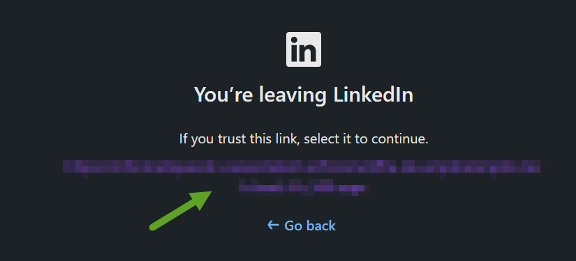

# LinkedinSafetyPageSkip

This userscript skips the safety page and immediately redirects to the target URL:

## Installing

### Userscript

#### Prerequisites

- A compatible web browser (Google Chrome, Firefox, Edge, etc.).
- The **Tampermonkey** extension installed.

#### Installing Tampermonkey

- **Google Chrome**: Go to the [Chrome Web Store](https://chromewebstore.google.com/detail/tampermonkey/dhdgffkkebhmkfjojejmpbldmpobfkfo?pli=1) and click "Add to Chrome".
- **Firefox**: Go to [Mozilla Add-ons](https://addons.mozilla.org/fr/firefox/addon/tampermonkey/) and click "Add to Firefox".
- **Other browsers**: Search for "Tampermonkey" in your browser's extension store (Edge, Opera, etc.).

#### Installing the LinkedinSponsorBlock script

1. **From Greasyfork:**

- Go to the script page: [LinkedinSafetyPageSkip](https://greasyfork.org/fr/scripts/546877-linkedinsponsorblock)
- Click "Install this script" and confirm

2. **From Github:**

- Click here: [LinkedinSafetyPageSkip.user.js](https://github.com/Hogwai/LinkedinSafetyPageSkip/raw/refs/heads/main/LinkedinSafetyPageSkip.user.js) and confirm.

3. **Verify that the script is enabled:**

- In the Tampermonkey dashboard (click the icon > "Dashboard"), ensure that the `LinkedinSafetyPageSkip` script is enabled (switch to "On").

#### Troubleshooting

**Script not working?**

- Verify that Tampermonkey is enabled and that the script is correctly installed.
- Check the browser console for error messages.

**Persistent issues?**

- Open an issue via [GitHub](https://github.com/Hogwai/LinkedinSafetyPageSkip/issues) or try to update the script.

## License

This project is licensed under the MIT License.
